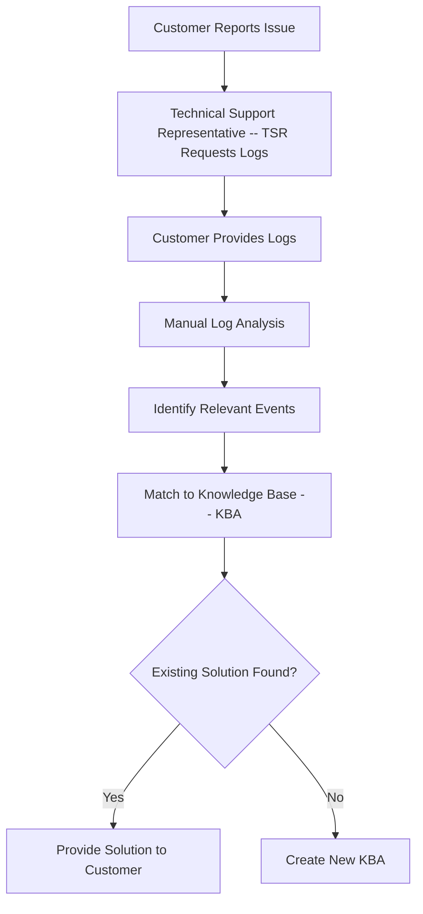
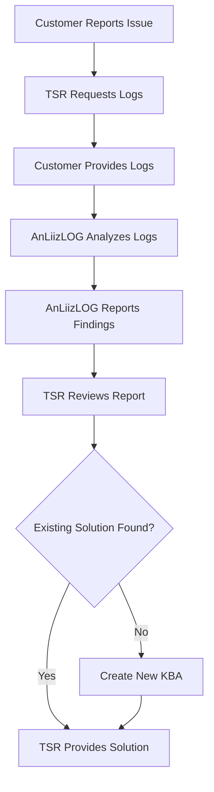

# LogAnalyzer_AnLiizLOG
Parsing, Analyzing and Reporting of log files using regex built on Python

Monitoring of hardware and software application logs is a critical practice in order to improve the quality and health of the environment. Every application (hardware or software) produces a log that tracks activities (events). These logs need to be provided to the Technical Support Representative in order to troubleshoot any errors, failures, performance issues or other concern.  The log analyzer tool (AnLiizLOG) is purposed to assist (in the scope of) a Software Technical Support Representative. And will contribute to the support representive's ability to find, document, match the discovered (problem) events to existing known KBA (knowledgebase) or define and document a new KBA. This will accelerate the process of offering a solution to the end user (customer).  This tool will scan the given log file(s) using regular expressions. Typically one is looking for warnings, errors, and severity messages that are pertinent to their application profile of the likes of performance of: operating system, storage management system, network, security (vulnerabilites), and, deployed software applications... 

AnLiizLOG: Workflow Analysis

Problem (AS-IS) Workflow:

	1. Customer Reports Issue:
		The customer encounters an issue with their software or system.
	2. Technical Support Representative (TSR) Requests Logs:
		The TSR requests log files from the customer to diagnose the problem.
	3. Customer Provides Logs:
		The customer gathers and sends log files, potentially compressed, to the TSR. (May involve multiple emails or file transfers)
	4. Manual Log Analysis:
		The TSR manually analyzes the logs, searching for relevant keywords and timestamps. This is time-consuming and error-prone.
	5. Identify Relevant Events:
		The TSR identifies potential errors, warnings, severity messages and timestamps related to the reported issue.
	6. Match to Knowledge Base (KBA):
		The TSR searches the KBA for existing solutions based on the identified events.
	7. Create New KBA (if needed):
		If no existing solution is found, the TSR creates a new KBA documenting the issue and resolution.
	8. Provide Solution to Customer:
		The TSR communicates the solution to the customer, potentially requiring further troubleshooting if no solution is found.

Solution (TO-BE) Workflow:

	1. Customer Reports Issue:
		Similar to the AS-IS workflow.
	2. TSR Requests Logs:
		Similar to the AS-IS workflow.
	3. Customer Provides Logs:
		Similar to the AS-IS workflow.
	4. AnLiizLOG Analyzes Logs:
		The TSR uploads the log files to AnLiizLOG.
		
		AnLiizLOG performs the following actions:
			Parsing: Analyzes the log file format (text, JSON, etc.) and extracts relevant data points like timestamps and messages.
			Regular Expression Matching: Uses predefined regular expressions to identify warnings/informational ('WARNING'), errors ('Error: nnnn'), stacktrace ('Signal nn' or 'SEGV'), Failure ('Fatal', 'Failed', 'Failure'), and other relevant events based on application profiles (OS, storage, network, etc.)
	5. AnLiizLOG Reports Findings:
		AnLiizLOG presents a report summarizing:
			Extracted timestamps
			Identified events with severity levels
	6. TSR Reviews Report:
		The TSR reviews AnLiizLOG's report, focusing on relevant events
	7. TSR Provides Solution:
		Based on the report and their expertise, the TSR determines the solution and communicates it to the customer.
	8. Create New KBA (if needed):
		If no existing solution is found, the TSR leverages AnLiizLOG's findings to create a new KBA more efficiently.

