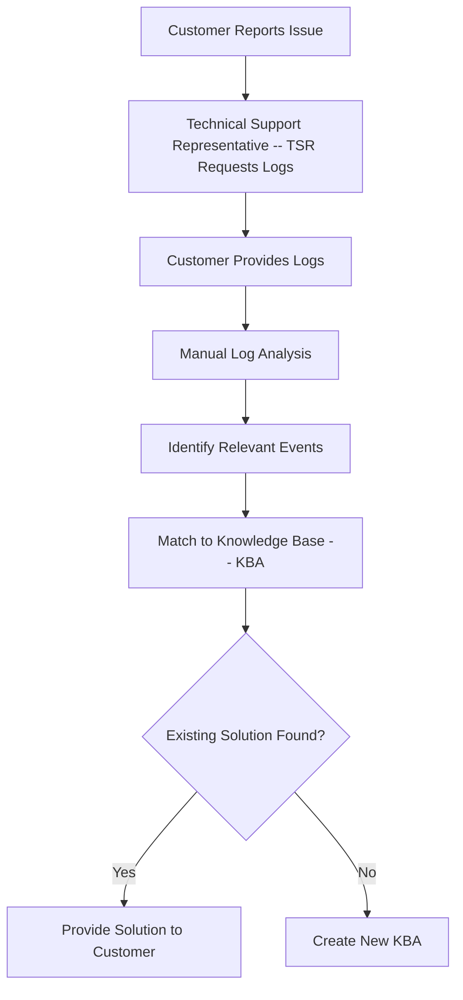

```mermaid
flowchart TD
    A[Customer Reports Issue] --> B[Technical Support Representative -- TSR Requests Logs]
    B --> C[Customer Provides Logs]
    C --> D[Manual Log Analysis]
    D --> E[Identify Relevant Events]
    E --> F[Match to Knowledge Base -- KBA]
    F --> G{Existing Solution Found?}
    G -->|Yes| H[Provide Solution to Customer]
    G -->|No| I[Create New KBA]
```